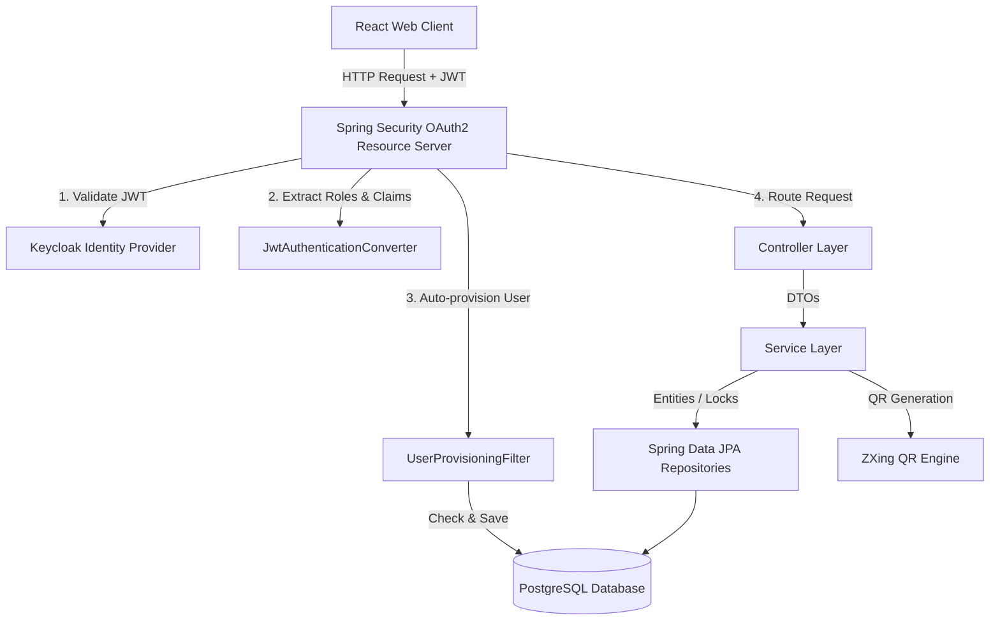
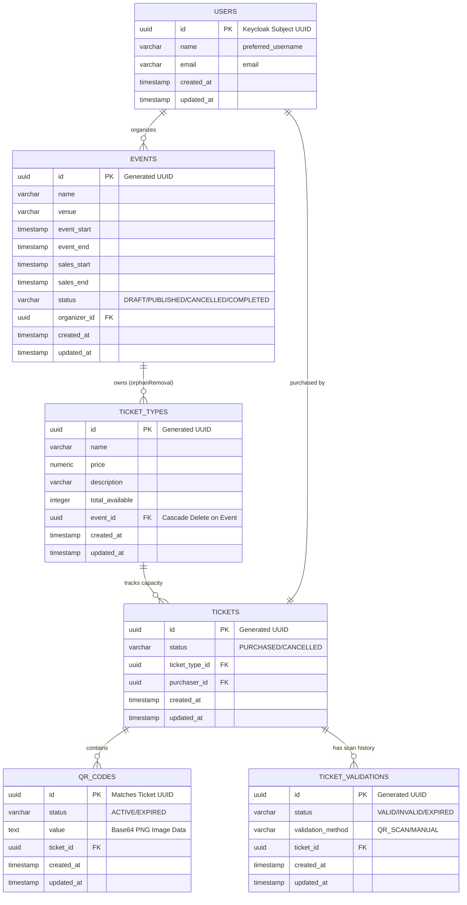
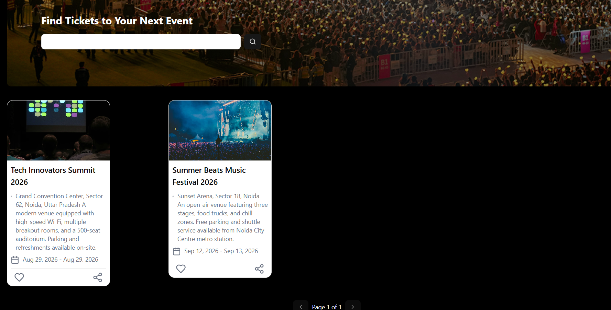
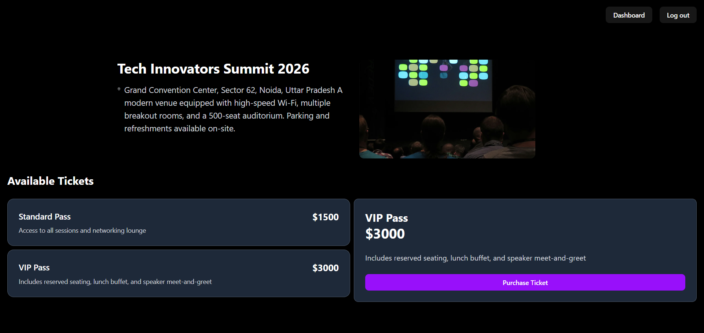
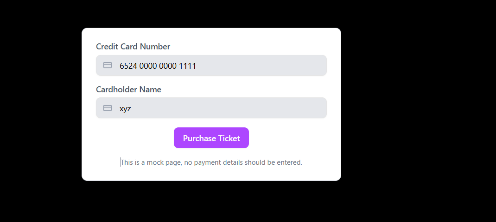
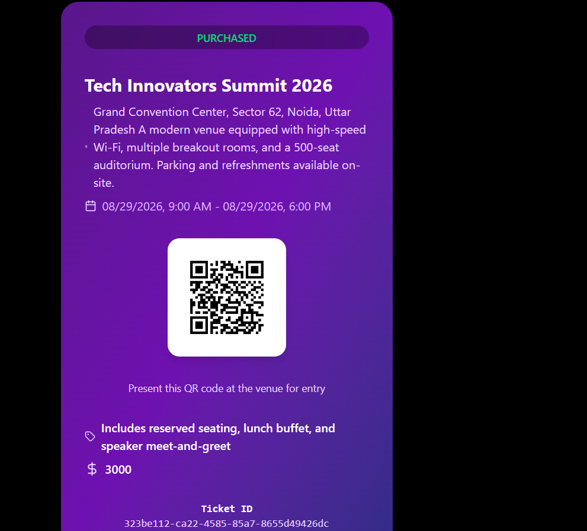
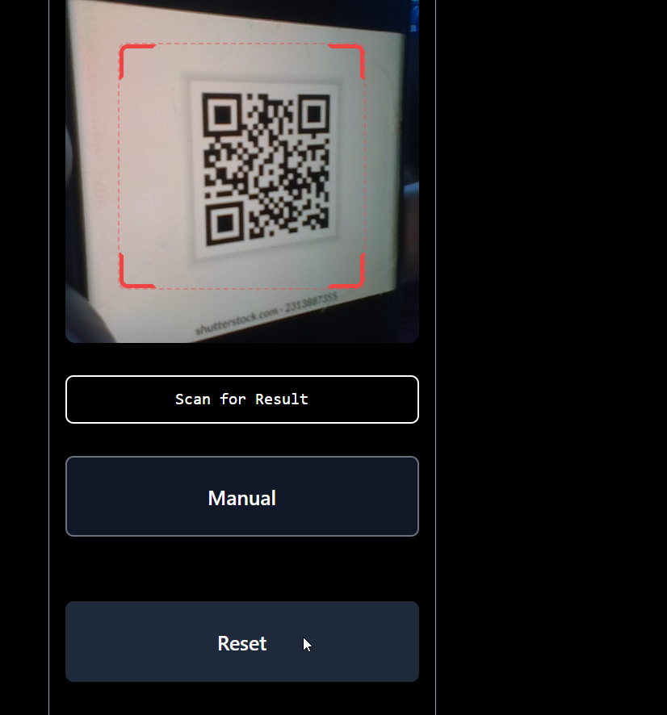
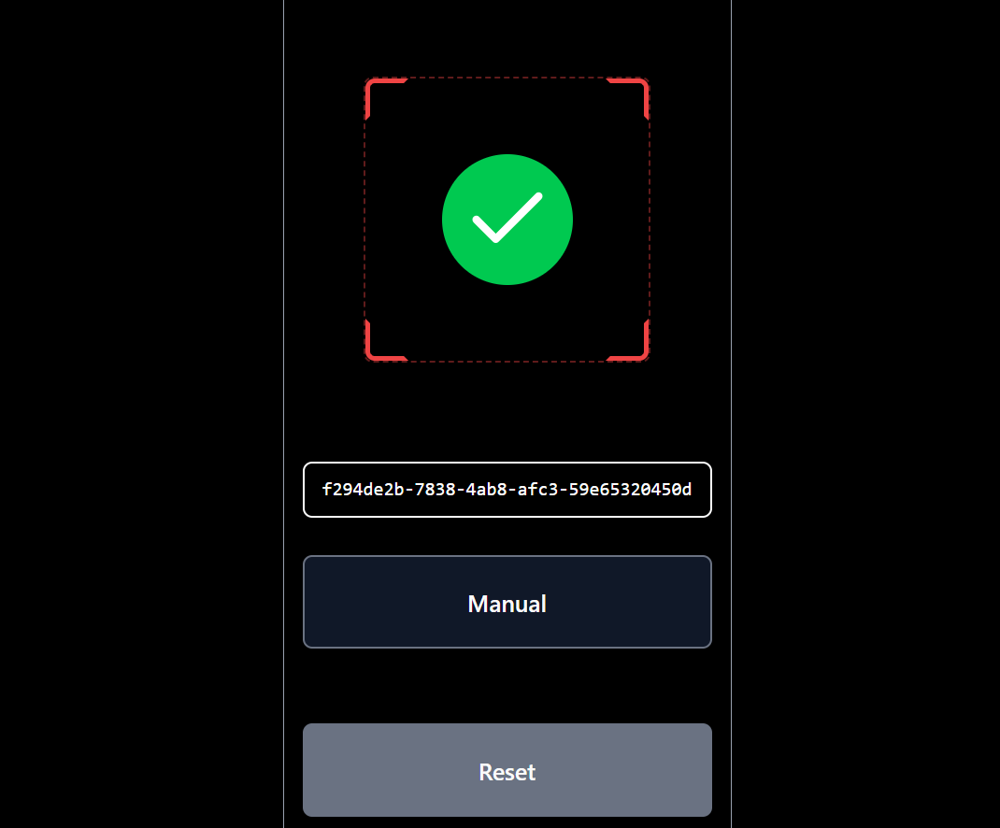

# Gather

A secure, high-concurrency event ticketing and validation platform built with **Spring Boot** (Java 21), **PostgreSQL**, and **React** (Vite + TS + TailwindCSS v4), featuring authentication via **Keycloak** (OAuth2/OIDC) and real-time QR code ticket validation.

---

## 🏗️ Architectural System Overview

The platform uses a classic **Three-Tier Architecture** integrated with a central OAuth2 Identity Provider (Keycloak) and a relational database (PostgreSQL), all orchestrated inside Docker containers for local development.

### Infrastructure Services (Docker)
The local development infrastructure is orchestrated using Docker Compose (defined in [docker-compose.yml](file:///c:/Users/Hp/Desktop/Event%20Ticket%20Platform/Backend/docker-compose.yml)):
* **db**: PostgreSQL 16 exposed on port `5433` (mapped to `5432` internally).
* **keycloak**: Keycloak identity server running on port `9090`.
* **adminer**: Database administration console running on port `8888`.

---

## 🗄️ Database Domain & ER Model

Database schemas are mapped using JPA annotations with automatic updates enabled via Hibernate (`spring.jpa.hibernate.ddl-auto=update`).

---

## 🔒 Security & Core Mechanics
* **Authentication & Provisioning**: Secured using Keycloak OIDC JWT tokens, with custom role mapping and automated user provisioning in the local database upon first login.
* **Concurrency & Verification**: Employs database-level pessimistic write locking (`SELECT ... FOR UPDATE`) to prevent overselling, and checks validation history to block duplicate scans.
* **Search Engine**: Uses native PostgreSQL full-text search (`tsvector` / `tsquery`) with GIN indexing for fast, linguistics-aware search performance.

---

## 🚀 Setup & Run Instructions

1. **Start Infrastructure**: Run `docker compose up -d` in the `Backend` folder to launch PostgreSQL, Keycloak, and Adminer.
2. **Launch Backend**: Run `./mvnw spring-boot:run` in the `Backend` folder to start the Spring Boot API at `http://localhost:8080`.
3. **Launch Frontend**: Run `npm install` and `npm run dev` in the `Frontend` folder to start the React web application at `http://localhost:5173`.

---

## 📸 Application Screens & User Flows

### 1. Attendee Homepage & Public Event Search
*Browse published events and query events using native full-text search.*
 

### 2. Event Details & Ticket Options
*View event descriptions, metadata, and available ticket types.*
 

### 3. Ticket Checkout & Purchase List
*Secure purchase page and list of purchased tickets under the attendee's profile.*
 
 

### 4. Ticket Receipt with QR Code
*Receipt showing ticket details and a dynamic PNG QR Code generated by the backend's ZXing engine.*
 

### 5. Organizer Event Dashboard
*Dashboard allowing organizers to create, publish, modify, or delete their events.*
 

### 6. Staff Ticket Scanner
*Camera-driven scanner interface checking tickets against the backend API to prevent duplicate entries.*
 
&nbsp;&nbsp;
