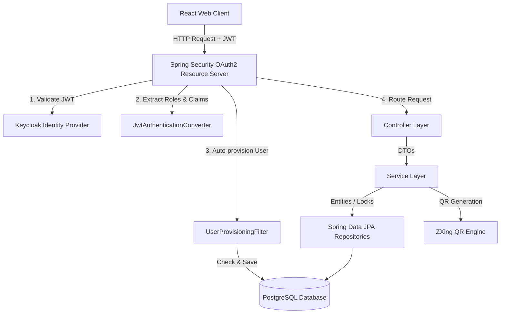
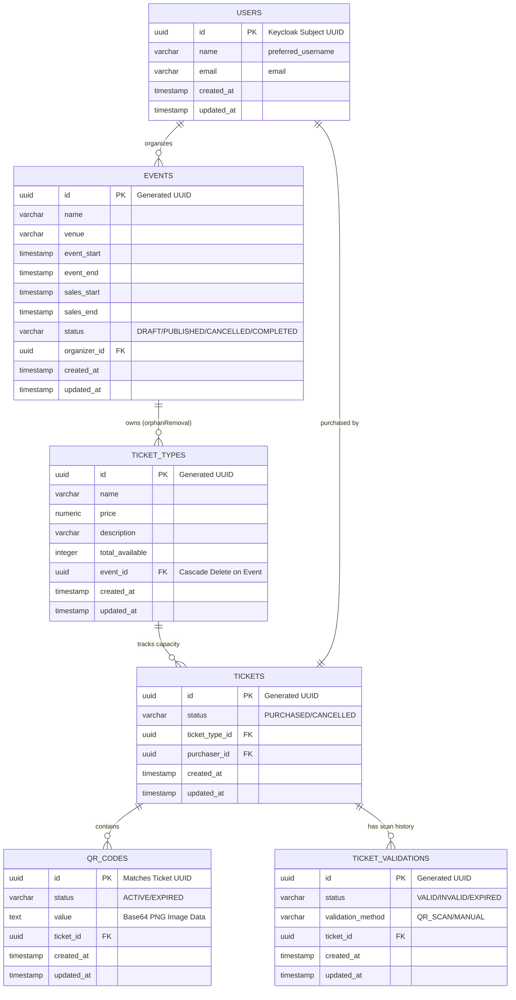

# Gather

Gather is a secure, high-concurrency event ticketing and validation platform. The backend is built using **Spring Boot** (Java 21) and **PostgreSQL**, while the frontend is built with **React** (Vite + TS + TailwindCSS v4). User authentication and security are handled through **Keycloak** (OAuth2/OIDC), and ticket validation happens in real-time using QR codes.

---

## How It Works (Architecture)

The project uses a standard three-tier architecture. We use Keycloak as our OAuth2 Identity Provider, PostgreSQL for the database, and run everything locally inside Docker containers.

### Running with Docker
The local services are defined in [docker-compose.yml](file:///c:/Users/Hp/Desktop/Event%20Ticket%20Platform/Backend/docker-compose.yml):
* **db**: PostgreSQL 16 running on port `5433` (mapped to `5432` internally).
* **keycloak**: Keycloak identity server running on port `9090`.
* **adminer**: Database administration console running on port `8888`.

---

## Database Schema

Database tables are mapped using JPA annotations. Hibernate handles schema updates automatically when the backend starts up (`spring.jpa.hibernate.ddl-auto=update`).

Here is how the tables are structured and connected:

---

## Features & Implementation Details

* **Auth & User Sync**: We use Keycloak OIDC for logins. When a user logs in for the first time, a custom filter extracts their profile details and automatically creates a user record in the local database.
* **Preventing Double Bookings**: To prevent selling more tickets than available, we use database-level pessimistic write locking (`SELECT ... FOR UPDATE`). We also track verification logs to ensure a ticket's QR code cannot be scanned twice.
* **Event Search**: We use PostgreSQL's native full-text search (`tsvector` / `tsquery`) with GIN indexing for fast, linguistics-aware search performance.

---

## Getting Started

1. **Start the Database & Auth**: Run `docker compose up -d` in the `Backend` folder to launch PostgreSQL, Keycloak, and Adminer.
2. **Start the Backend**: Run `./mvnw spring-boot:run` in the `Backend` folder. The API will start at `http://localhost:8080`.
3. **Start the Frontend**: Run `npm install` and then `npm run dev` in the `Frontend` folder to launch the React app at `http://localhost:5173`.

---

## App Screenshots

### 1. Attendee Homepage & Event Search
Where attendees can browse events and search through them using the full-text search bar.
 

### 2. Event Details & Ticket Options
View the event description, location, timing, and select ticket types.
 

### 3. Checkout & Purchased Tickets
Purchase tickets and view them in the user profile dashboard.
 
 

### 4. Ticket Receipt with QR Code
A dynamic ticket showing the barcode/QR code generated by the backend's ZXing engine.
 

### 5. Organizer Event Dashboard
Where organizers can manage, publish, and edit their events.
 

### 6. Entry Validation (Staff Scanner)
The scanning interface used by event staff to verify tickets in real-time.
 
&nbsp;&nbsp;

